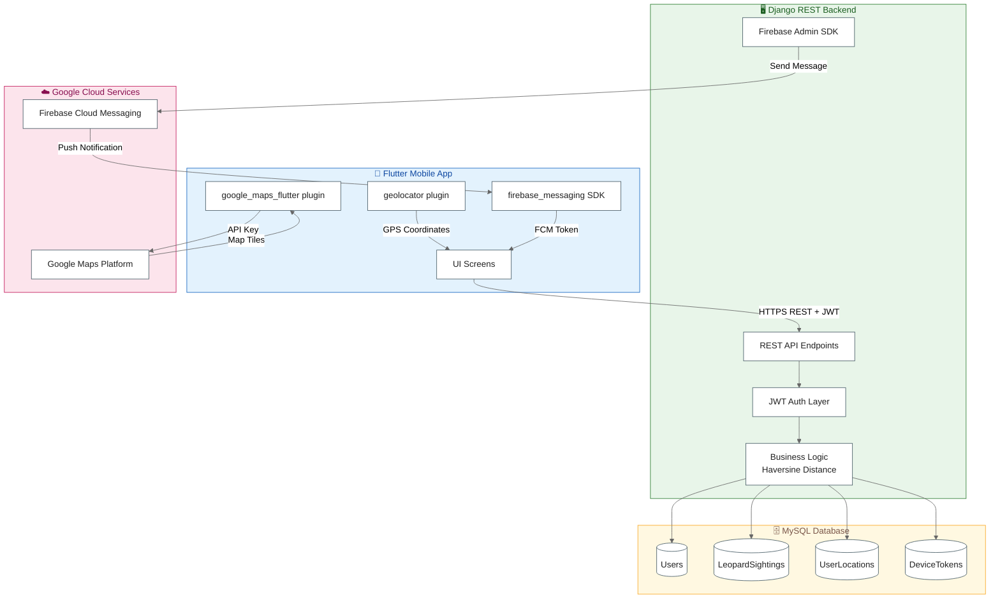
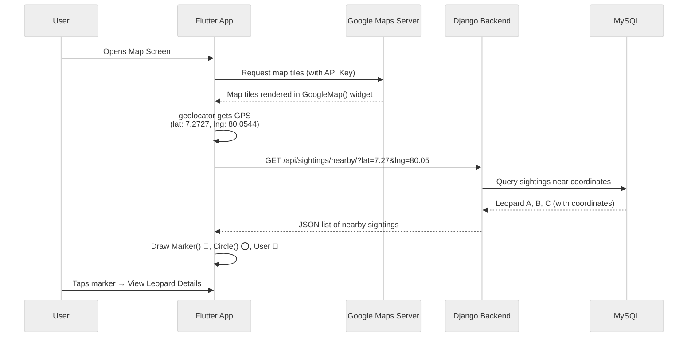
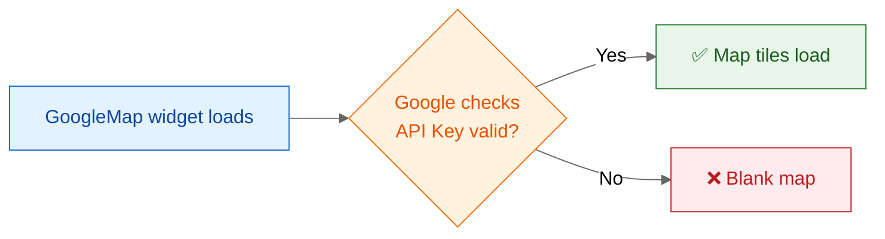
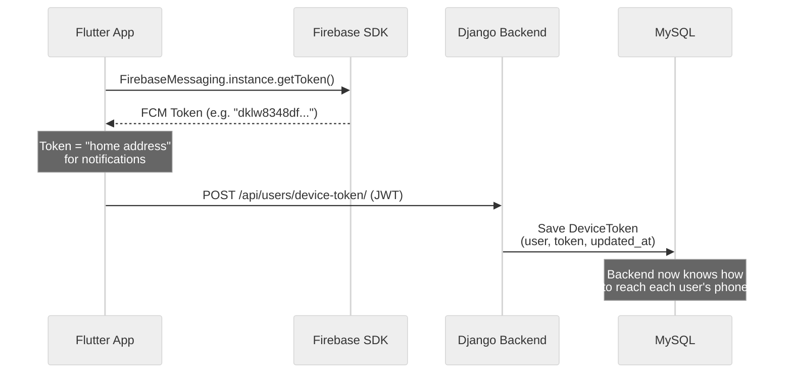
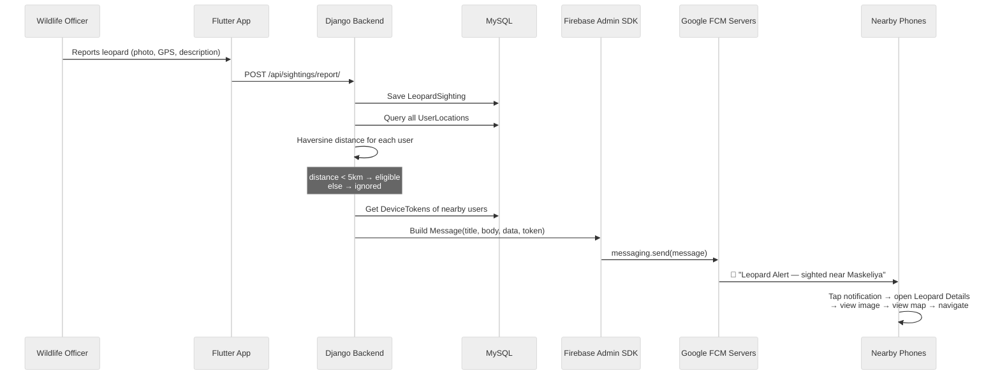
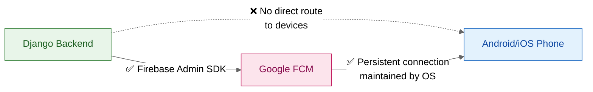
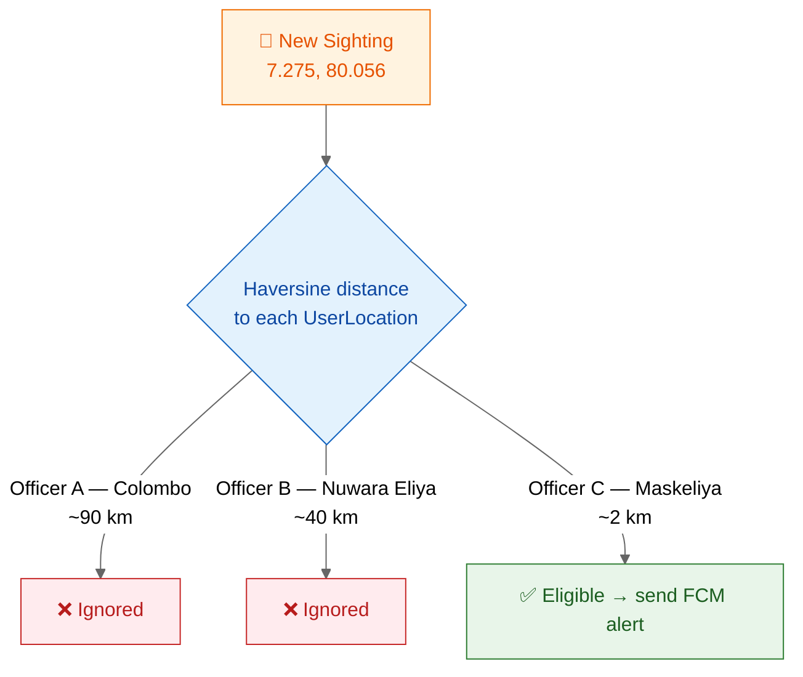
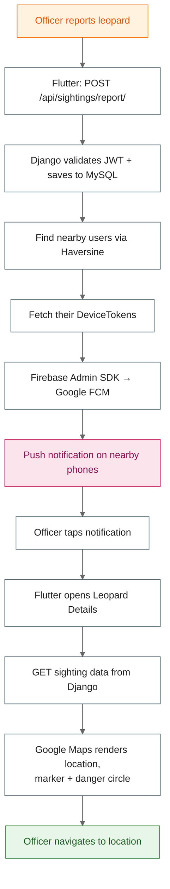
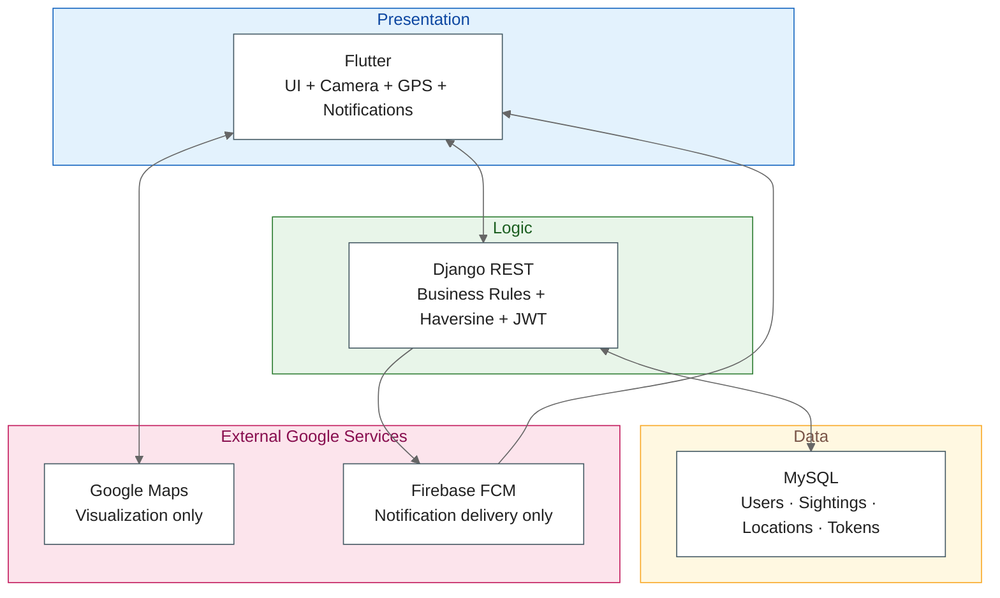

# Leopard Sightings — Service Architecture & Codebase Integration

This document explains how the external services (**Google Maps Platform** and **Firebase Cloud Messaging**) connect to the codebase (Flutter + Django + MySQL) and how data flows through the system.

---

## 1. High-Level System Architecture

---

## 2. Where Each Service Connects in the Codebase

| Service | Codebase Location | Purpose |
|---|---|---|
| Google Maps SDK | `AndroidManifest.xml` (API Key), `Info.plist` / `AppDelegate` (iOS), `google_maps_flutter` widget | Render map tiles, markers, danger circles |
| Geolocator | Flutter — `geolocator` package | Get device GPS coordinates |
| Firebase SDK | Flutter — `firebase_messaging`, `google-services.json` / `GoogleService-Info.plist` | Receive push notifications, generate FCM token |
| Firebase Admin SDK | Django backend — service account credentials JSON | Send notifications from server → Google FCM |
| MySQL | Django ORM models | Persist users, sightings, locations, tokens |
| JWT | Django REST Framework endpoints | Authenticate every API request |

---

## 3. Google Maps — How It Connects & Works

Google Maps only **displays** geography. It stores nothing and sends nothing.

**Key point:** Map tiles come from Google; **all sighting data comes from your own backend.**

### API Key Validation Flow

---

## 4. Firebase Cloud Messaging — How It Connects & Works

FCM's only job is **delivering push notifications**. It stores no app data.

### 4a. Device Token Registration (happens on app install/login)

### 4b. Sighting Report → Notification Pipeline

### Why the Backend Can't Notify Phones Directly

Google FCM acts as the **delivery network** — phones keep a persistent connection to Google's servers, not to your backend.

---

## 5. Nearby-User Filtering (Haversine)

Without stored `UserLocation` data, the backend would have to notify **everyone** — location filtering makes alerts relevant.

---

## 6. Complete End-to-End Flow

---

## 7. API Endpoints Map

```mermaid
%%{init: {'theme':'neutral'}}%%
flowchart LR
    subgraph Auth["🔐 Authentication"]
        A1[POST /api/auth/register/]
        A2[POST /api/auth/login/]
        A3[POST /api/token/refresh/]
        A4[GET / PATCH /api/users/me/]
    end

    subgraph Loc["📍 Location & Devices"]
        B1[POST /api/users/location/]
        B2[POST /api/users/device-token/]
    end

    subgraph Sight["🐆 Sightings"]
        C1[POST /api/sightings/report/]
        C2[GET /api/sightings/]
        C3[GET /api/sightings/nearby/]
    end

    Auth --> Loc --> Sight

    style Auth fill:#e3f2fd,stroke:#1565c0,color:#0d47a1
    style Loc fill:#fff8e1,stroke:#f9a825,color:#795548
    style Sight fill:#e8f5e9,stroke:#2e7d32,color:#1b5e20

    classDef ep fill:#ffffff,stroke:#455a64,color:#212121
    class A1,A2,A3,A4,B1,B2,C1,C2,C3 ep
```

| Endpoint | Used By | Triggers |
|---|---|---|
| `POST /api/users/device-token/` | Flutter (Firebase SDK token) | Stores notification address |
| `POST /api/users/location/` | Flutter (geolocator) | Enables Haversine filtering |
| `POST /api/sightings/report/` | Flutter (report form) | Saves sighting **and** starts FCM pipeline |
| `GET /api/sightings/nearby/` | Flutter (map screen) | Feeds markers to Google Maps widget |

---

## 8. Responsibility Matrix

| Technology | Responsibility |
|---|---|
| Flutter | Mobile UI, camera, GPS, receiving notifications |
| Django REST Framework | Business logic, API layer, notification triggering |
| MySQL | Persistent storage (users, sightings, locations, tokens) |
| Google Maps Platform | Map display and geographic visualization |
| Geolocator | Device GPS coordinates |
| Firebase Cloud Messaging | Push notification delivery network |
| Firebase Admin SDK | Secure server-side sending to FCM |
| JWT | API authentication and authorization |
| Haversine Formula | Distance calculation for nearby-user filtering |

---

## In One Sentence

> Officers report leopard sightings through the **Flutter** app → **Django** saves the report to **MySQL**, finds nearby officers with the **Haversine formula**, and pushes instant alerts via **Firebase Cloud Messaging**, while **Google Maps** visualizes sightings, danger zones, and navigation for rapid field response.